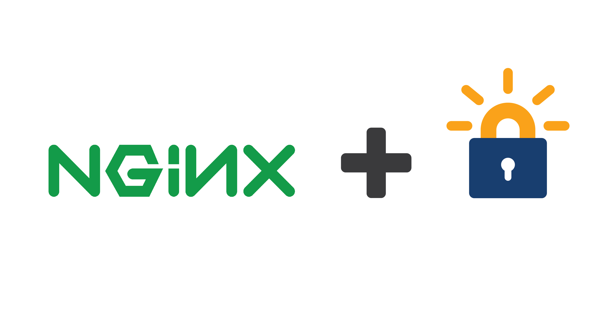
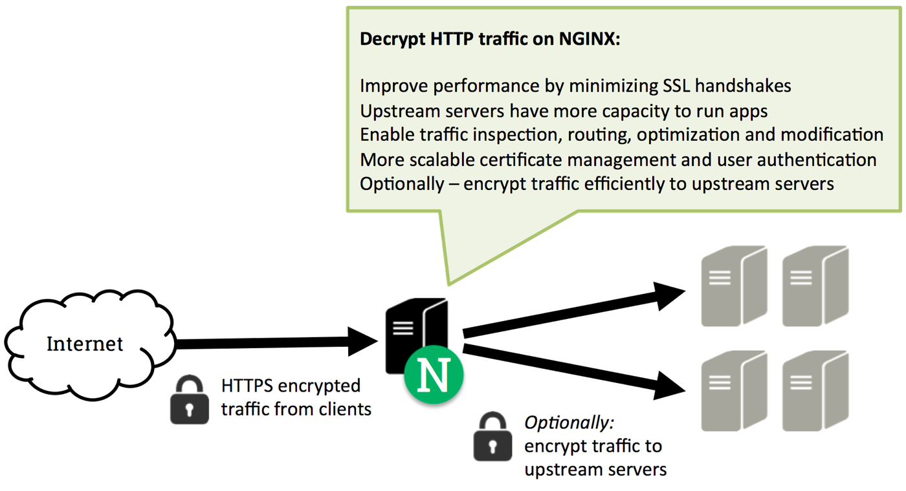

Let’s Encrypt is a free, automated, and open certificate authority (CA), run for the public’s benefit. It is a service provided by the Internet Security Research Group (ISRG).

A proxy server is a go‑between or intermediary server that forwards requests for content from multiple clients to different servers across the Internet. A reverse proxy server is a type of proxy server that typically sits behind the firewall in a private network and directs client requests to the appropriate backend server. A reverse proxy provides an additional level of abstraction and control to ensure the smooth flow of network traffic between clients and servers.
